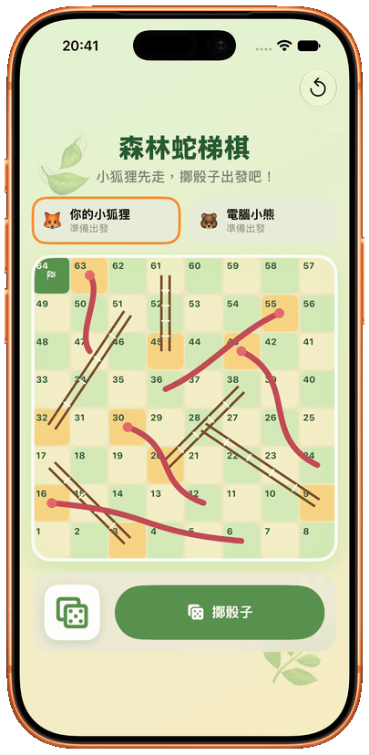
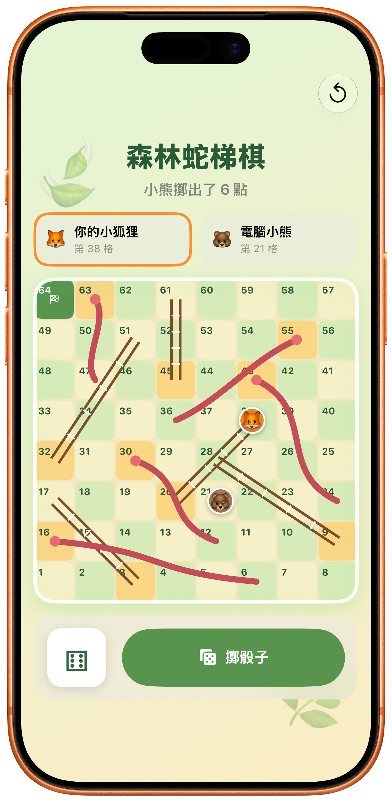
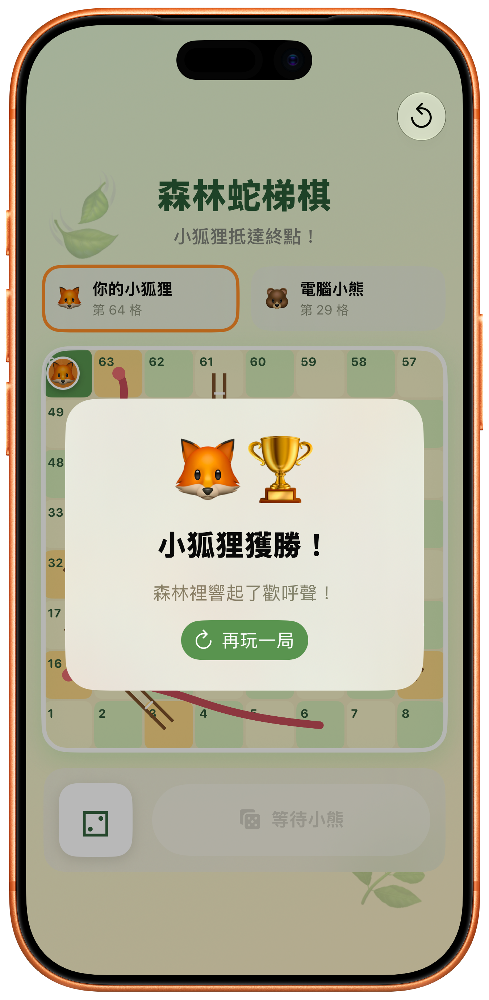

# 🌿 Forest Snakes & Ladders

### Roll the dice. Climb the vines. Outsmart the little bear. 🦊🎲🐻

**[English](#english) · [繁體中文](#繁體中文)**

 

---

## 🇬🇧 English

**Forest Snakes & Ladders** is a cheerful, forest-themed iOS take on the classic board game. Guide the little fox across a winding 8×8 board, race an automated bear opponent, climb vine ladders, and watch out for snakes on the way to square 64. 🍃

### ✨ Highlights

- 🎲 **One-tap turns** — roll a six-sided die and watch each piece move square by square.
- 🦊 **Fox vs. bear** — play against an automatic computer opponent.
- 🪜 **Classic board rules** — ladders carry you upward and snakes slide you back down.
- 🎯 **Exact finish** — the winning roll must land precisely on square 64.
- 💾 **Automatic game saving** — leave the app and continue from the same position later.
- 📳 **Delightful feedback** — movement, special squares, and victory have distinct haptics.
- ♿️ **Motion-aware** — animations adapt when Reduce Motion is enabled.
- 🧪 **Tested game logic** — movement, every snake and ladder, turn order, exact finishing, and persistence are covered with Swift Testing.

### 📸 Screenshots

  
  &nbsp;&nbsp;
  

### 🎮 How to Play

1. Tap **Roll Dice** to move the little fox. 🎲
2. The computer bear takes its turn automatically. 🐻
3. Land at the foot of a ladder to climb; land on a snake's head to slide down.
4. Reach square **64** with an exact roll before the bear to win. 🏆
5. Use the reset button in the top-right corner whenever you want a fresh match.

### 🛠 Tech Stack

- **Swift** and **SwiftUI**
- Observation with `@Observable`
- Swift Concurrency with `async` / `await`
- `UserDefaults`-backed game persistence
- Swift Testing

### 🚀 Run Locally

1. Clone this repository.
2. Open `Snakes and Ladders.xcodeproj` in Xcode.
3. Select an iPhone simulator or a connected iPhone.
4. Press **Run** (`⌘R`).

### 🧪 Testing

Run the test suite in Xcode with **Product → Test** (`⌘U`).

<a href="#english">Back to English top ↑</a> · <a href="#繁體中文">切換至中文 →</a>

---

## 🇹🇼 繁體中文

**森林蛇梯棋**是一款充滿森林氣息的 iOS 經典棋盤遊戲。帶領小狐狸穿越蜿蜒的 8×8 棋盤，和自動行動的電腦小熊競賽；沿途爬上藤蔓梯子、避開調皮小蛇，率先抵達第 64 格！🍃

### ✨ 遊戲特色

- 🎲 **一鍵擲骰**：擲出六面骰，看著棋子逐格前進。
- 🦊 **狐狸對決小熊**：和自動行動的電腦對手輪流競賽。
- 🪜 **經典蛇梯規則**：遇到梯子向上爬，碰到小蛇向下滑。
- 🎯 **精確抵達終點**：必須擲出剛好的點數，才能停在第 64 格獲勝。
- 💾 **自動保存進度**：離開 App 後，下一次可接續同一場遊戲。
- 📳 **細緻觸覺回饋**：移動、觸發特殊格與獲勝都有不同回饋。
- ♿️ **支援減少動態效果**：依照系統的 Reduce Motion 設定調整動畫。
- 🧪 **完整邏輯測試**：涵蓋移動、所有蛇梯、回合順序、精確終點與進度保存。

### 📸 遊戲畫面

  
  &nbsp;&nbsp;
  

### 🎮 遊玩方式

1. 點擊**擲骰子**，讓小狐狸前進。🎲
2. 電腦小熊會自動完成它的回合。🐻
3. 停在梯子底端就能向上爬；停在蛇頭則會向下滑。
4. 在小熊之前，以精確點數抵達第 **64** 格即可獲勝。🏆
5. 想重新挑戰時，使用右上角的重新開始按鈕。

### 🛠 技術架構

- **Swift** 與 **SwiftUI**
- 使用 `@Observable` 管理狀態
- 使用 `async` / `await` 實作非同步回合流程
- 透過 `UserDefaults` 保存遊戲進度
- 使用 Swift Testing 驗證遊戲邏輯

### 🚀 執行專案

1. Clone 此 repository。
2. 使用 Xcode 開啟 `Snakes and Ladders.xcodeproj`。
3. 選擇 iPhone 模擬器或已連接的 iPhone。
4. 按下**執行**（`⌘R`）。

### 🧪 執行測試

在 Xcode 選擇 **Product → Test**（`⌘U`）即可執行測試套件。

<a href="#繁體中文">回到中文版頂端 ↑</a> · <a href="#english">Switch to English →</a>

---

Made with 🌱, SwiftUI, and one very lucky fox.

